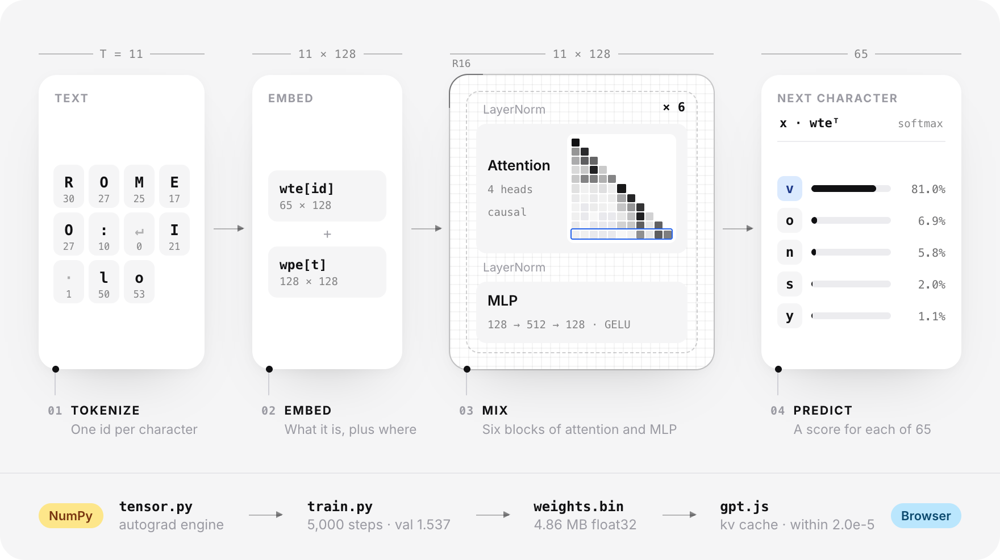
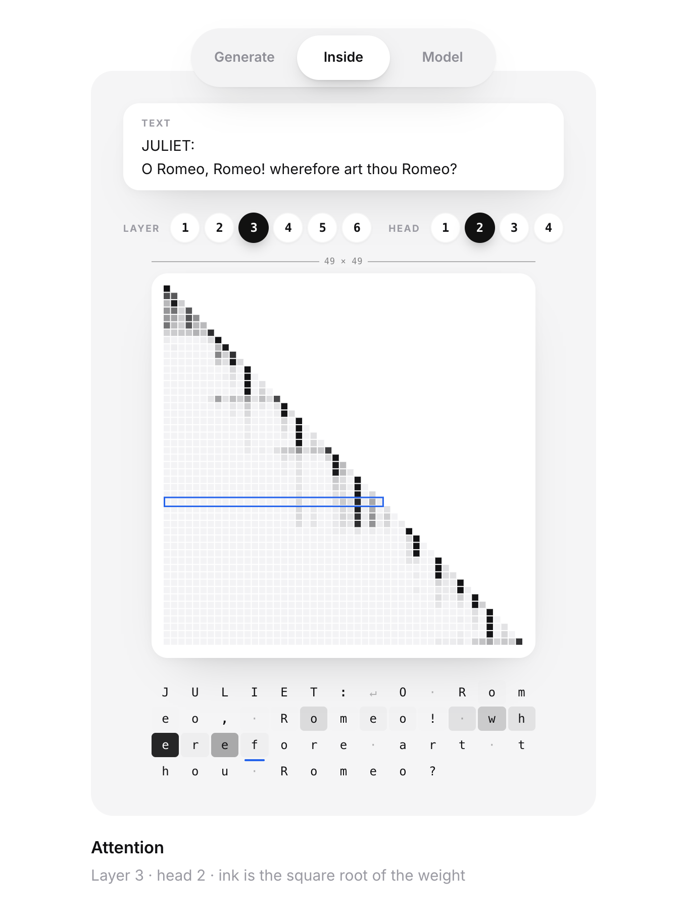
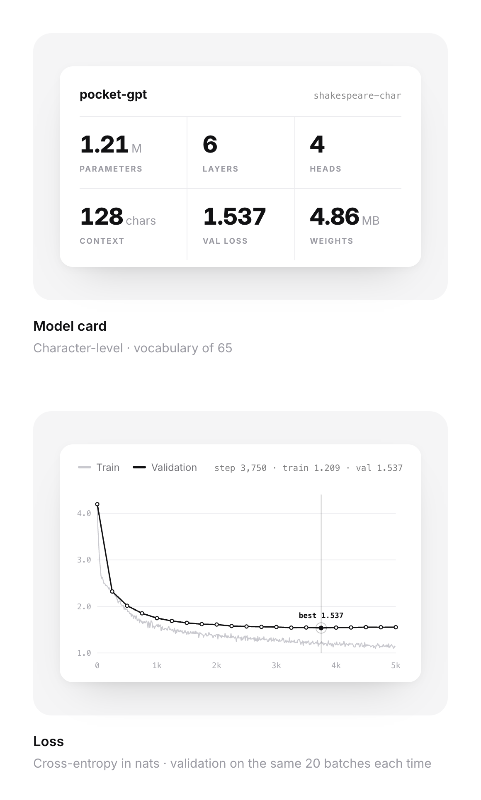

# pocket-gpt

A GPT trained from scratch in pure NumPy, on an autograd engine of about 360 lines.

<p align="center">
  <a href="https://stxqq.github.io/pocket-gpt/"></a>
</p>

<p align="center">
  <a href="https://github.com/Stxqq/pocket-gpt/actions/workflows/ci.yml"></a>
  <a href="https://stxqq.github.io/pocket-gpt/"></a>
  
  
  
</p>

<p align="center">
  <a href="https://stxqq.github.io/pocket-gpt/"><picture>
      <source media="(prefers-color-scheme: dark)" srcset=".github/assets/launch-dark.png">
      
    </picture></a>
  <a href="https://github.com/Stxqq/pocket-gpt"><picture>
      <source media="(prefers-color-scheme: dark)" srcset=".github/assets/star-dark.png">
      
    </picture></a>
  <br />
  <sub>If you found it useful, a star helps more people find it.</sub>
</p>

## What it is

No PyTorch, no JAX. `pocketgpt/tensor.py` is a reverse-mode autograd engine
over numpy arrays (under 400 lines), `pocketgpt/nn.py` builds a GPT-2 style
decoder on top of it, and `train.py` trains that on tiny shakespeare on a
laptop CPU in about a quarter of an hour.

I wanted something between micrograd (scalars, great for intuition, far too
slow for a transformer) and nanoGPT (fast, but the interesting part lives
inside PyTorch). Here every gradient in the model is plain numpy you can put
a breakpoint in.

## How it works

<p align="center">
  
</p>

The prompt above is real: the published model reads `ROMEO:` and `I lo`
and gives `v` 81.0%, `o` 6.9% and `n` 5.8%. The little map is layer 4, head
2, where the last `o` mostly looks back at `l`, `o` and `I`. Underneath it is
a GPT-2 style decoder: pre-norm blocks, four causal heads of width 32, a 4x
MLP with GELU, and an output head that reuses the token embedding.

Every op computes its value eagerly and, while gradients are on, keeps a
closure that turns the output gradient into one gradient per input.
`backward()` sorts the graph topologically and runs those closures in
reverse. Broadcasting is undone by summing the gradient back to each input's
shape.

A few ops are fused because the naive versions are slow or unstable:
softmax, cross entropy (log-sum-exp with the `probs - onehot` backward) and
layer norm (the closed-form backward instead of a dozen tiny nodes).
Training runs in float32; the tests switch the whole model to float64 and
compare every gradient against central finite differences.

The optimizer is AdamW with decoupled weight decay applied only to the
matmul weights, a linear warmup into cosine decay, and global grad-norm
clipping at 1.0.

## Quickstart

```bash
git clone https://github.com/Stxqq/pocket-gpt && cd pocket-gpt
python -m venv .venv && source .venv/bin/activate
pip install -e ".[dev]"

python sample.py --prompt "ROMEO:" --top-k 40
```

That samples from the trained model in `docs/model/`, the same files the
browser demo loads. To train your own:

```bash
python scripts/prepare.py         # downloads tiny shakespeare into data/
python train.py                   # ~15 min on a 14-core M-series CPU
python sample.py --prompt "ROMEO:" --top-k 40   # now uses out/shakespeare/ckpt.npz
```

## Usage

Training prints a line every 10 steps and evaluates every 250 on the same
fixed train and val windows, so the curve shows the model changing rather
than batch noise:

```
1,214,592 parameters, vocab 65
step     0 | train 4.1978 | val 4.1960
step     0 | loss 4.1889 | lr 1.00e-05 | norm 6.43 | 19,488 tok/s
...
step   250 | train 2.3107 | val 2.3211
...
step  3750 | train 1.2094 | val 1.5367
...
step  5000 | train 1.1427 | val 1.5529
best val 1.5367, 23,724 tok/s
```

Every field of the config dataclass is a flag, e.g.
`python train.py --n-layer 4 --max-steps 2000 --dropout 0.1`.

Sampling from the published model
(`python sample.py --model docs/model --prompt "ROMEO:" --tokens 400 --temperature 0.8 --top-k 40 --seed 7`):

```
ROMEO:
What, will I know you?

ISABELLA:
He
seensed doth scope, you may let this sun,
As as much the same will, in procof.

GREMIO:
Fear nor my lord, for my soul:
I am the prevail between thus I delay
That thou art a kinsman to short; please there mean
To light because in her better to have
And cannot the drown of men down to strange on;
Which if thy very and there for my chaste?
```

The autograd engine works on its own too:

```python
import numpy as np
from pocketgpt import Tensor

x = Tensor(np.array([1.0, 2.0, 3.0]), requires_grad=True)
y = (x * x).sum() + x.gelu().mean()
y.backward()
print(x.grad)  # [2.36098803 4.36203309 6.33719472]
```

`python export.py` writes the browser format: `weights.bin` (every parameter
back to back as little-endian float32), `model.json` (config, vocab, shape
and byte offset of each tensor) and `fixture.json` (logits for a full
128-character window of the val split, so the JavaScript port can prove it
computes the same function at every position).

## In the browser

The [live demo](https://stxqq.github.io/pocket-gpt/) runs the same weights
with no server behind it. `docs/js/gpt.js` is a second implementation of the
forward pass in plain JavaScript: Float32Array matmuls, layer norm, GELU and
attention, one token at a time with a key/value cache. It lives in a Web
Worker, so sampling never blocks the page.

Positions are absolute, so once the 128-character window is full the cache
can't slide. Instead of recomputing all 128 positions for every new
character, it restarts from the last 64, which costs about two forward steps
per character.

The page has three views: *Generate* streams text with temperature and top-k
sliders, *Inside* draws the attention weights of any layer and head over the
last 64 characters together with the model's top 10 guesses at each spot,
and *Model* shows the numbers and loss curve from the training log.

<p align="center">
  
  
  
</p>

`scripts/check_web.mjs` runs the JavaScript engine under Node and compares
its logits with `fixture.json`, which the numpy model wrote at export time.
It also fills the window, restarts it from the last half the way the worker
does, and checks the reused cache against a fresh one. CI fails if any logit
differs by more than 1e-4:

```
$ node scripts/check_web.mjs
8320 logits over 128 positions: max |js - numpy| = 2.00e-5 (limit 0.0001) ok
restart from the last 64 tokens: ok
```

To run the site locally (ES modules need a server, not `file://`):

```bash
python -m http.server 8000 -d docs
```

## Project layout

```
pocketgpt/
  tensor.py       autograd engine and the fused ops
  nn.py           Module, Linear, Embedding, LayerNorm, attention, GPT
  optim.py        AdamW, cosine schedule, grad clipping
  tokenizer.py    character-level tokenizer
  data.py         train/val token files and random windows
  checkpoint.py   .npz checkpoints
  export.py       browser export
scripts/
  prepare.py      download and encode tiny shakespeare
  check_web.mjs   JS engine vs numpy logits
tests/            gradient checks, masking, overfitting, optimizer, export
train.py  sample.py  export.py
docs/
  index.html, style.css   the demo page
  js/gpt.js       the forward pass in JavaScript, with a kv cache
  js/worker.js    loads the weights, samples, records attention
  js/engine.js    the page's side of the worker
  js/generate.js, inside.js, modelcard.js, anatomy.js   one per view
  js/views.js, motion.js   pill nav, springs and lerps
  model/          the trained model and its loss log
```

## Results

The published model, trained with the defaults in `train.py`:

| | |
|---|---|
| parameters | 1,214,592 (6 layers, 4 heads, width 128, context 128) |
| training | 5,000 steps, batch 32 x 128 = 20.5M tokens |
| time | 863 s of compute, 23,724 tokens/s on a 14-core M-series CPU |
| best checkpoint | step 3,750: train 1.209, val 1.537 |
| last step | step 5,000: train 1.143, val 1.553 |
| export size | 4.86 MB float32 |

Val loss bottoms out around step 3,750 while train keeps falling, so
`train.py` only checkpoints on a new best val loss and that is the model in
`docs/model/`. A bit of dropout would buy more; at this size and budget I
preferred the faster run.

Throughput of one optimizer step (forward, backward, AdamW) at batch 32 x 128,
numpy 2.5 with Apple Accelerate, from a short benchmark before the long run
(the long run shared the machine, hence its lower average):

| config | params | ms / step | tokens / s |
|---|---|---|---|
| 4 layers, width 128 | 0.82M | 102 | 39,991 |
| 4 layers, width 160 | 1.27M | 133 | 30,686 |
| 6 layers, width 128 | 1.21M | 144 | 28,514 |

The biggest single win: GELU originally used `x**3`, and float32 `power` in
numpy is about 35x slower than `x * x * x`. Swapping it took the 4-layer step
from 132 ms to 102 ms.

In the browser, Chrome samples about 675 characters/s (five 800-character
runs, 658 to 697) on the same laptop while it was busy with other work. In the
JavaScript matmul, handling four input rows per pass over the output took
Node from 446 to about 780 characters/s.

The test suite (64 tests, gradient checks for every op and for a whole
2-layer GPT in float64) runs in about a second on a fresh install, 0.3 to
0.4 s once Python's caches are warm.

## References

- Andrej Karpathy, [Let's build GPT: from scratch, in code, spelled out](https://www.youtube.com/watch?v=kCc8FmEb1nY),
  and [nanoGPT](https://github.com/karpathy/nanoGPT). The model shape, the
  tiny shakespeare setup and the eval loop follow them closely; the code here
  is my own, written against numpy instead of PyTorch.
- Karpathy's [micrograd](https://github.com/karpathy/micrograd) for the idea
  of a closure per op.
- Radford et al., *Language Models are Unsupervised Multitask Learners* (GPT-2),
  for pre-norm blocks and scaled residual init.
- Loshchilov and Hutter, *Decoupled Weight Decay Regularization* (AdamW).
- Hendrycks and Gimpel, *Gaussian Error Linear Units* (the tanh approximation).
- Tiny shakespeare from Karpathy's [char-rnn](https://github.com/karpathy/char-rnn).

## License

MIT © 2026 Stefan Carapic
